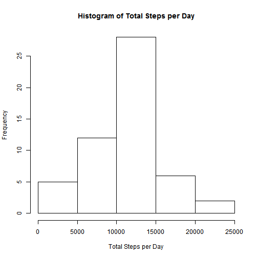
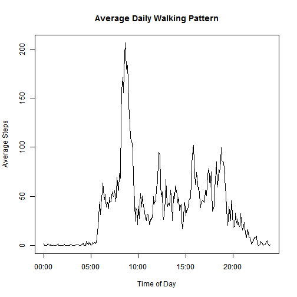
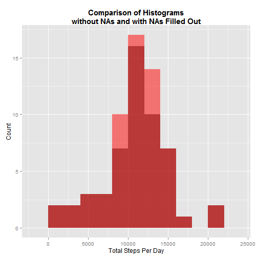
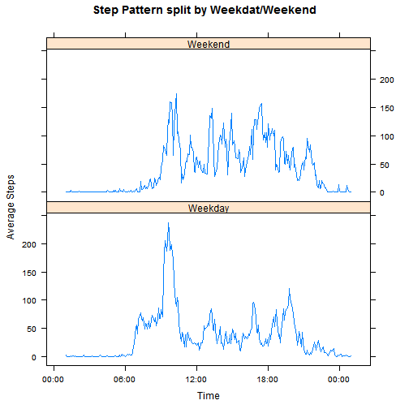

Required packages: lubridate, dplyr, tidyr, ggplot2, lattice

## Loading and preprocessing the data

### 1. Load the data


```r
unzip("activity.zip")
activity <- read.csv("activity.csv", stringsAsFactors = F)
```

### 2. Process the data

The data processing will result in 4 columns:

- Number of steps (int)
- Date (POSIXct)
- Time (POSIXct, all associated with the same date)
- Timestamp (POSIXct, each time associated with the correct date)


```r
activity <- tbl_df(activity)
 
activity$interval <- formatC(activity$interval, width = 4, flag = "0")
activity$timestamp <- paste(activity$date, activity$interval)

activity$date <- ymd(activity$date)
activity$time <- as.POSIXct(activity$interval, tz = "GMT", format="%H%M")
activity$timestamp <- as.POSIXct(activity$timestamp, tz = "GMT", format = "%Y-%m-%d %H%M")

activity <- activity %>% select(steps, date, time, timestamp)
```

## What is mean total number of steps taken per day?

### 1. Make a histogram of the total number of steps taken each day

```r
steps.per.day <- activity %>% na.omit() %>% group_by(date) %>% summarise(total.steps = sum(steps))

hist(steps.per.day$total.steps, xlab = "Total Steps per Day", main = "Histogram of Total Steps per Day")
```

 

### 2. Calculate and report the **mean** and **median** total number of steps taken per day


```r
mean.steps.per.day <- mean(steps.per.day$total.steps)
median.steps.per.day <- median(steps.per.day$total.steps)
```

The **mean** total number of steps taken per day is 10766.19 and the **median** is 10765.

## What is the average daily activity pattern?

### 1. Make a time series plot (i.e. `type = "l"`) of the 5-minute interval (x-axis) and the average number of steps taken, averaged across all days (y-axis)


```r
daily.pattern <- activity %>% group_by(time) %>% summarise(average.steps = mean(steps, na.rm = T))

plot(x = daily.pattern$time, 
    y = daily.pattern$average.steps, 
    type = "l", 
    xlab = "Time of Day",
    ylab = "Average Steps",
    main = "Average Daily Walking Pattern")
```

 

### 2. Which 5-minute interval, on average across all the days in the dataset, contains the maximum number of steps?


```r
max.steps <- daily.pattern %>% arrange(desc(average.steps)) %>% slice(1)

max.steps
```

```
## Source: local data frame [1 x 2]
## 
##                  time average.steps
## 1 2015-06-09 08:35:00      206.1698
```

The 5 minute interval with the maximum number of steps is at 08:35.

## Imputing missing values

### 1. Calculate and report the total number of missing values in the dataset (i.e. the total number of rows with `NA`s)


```r
total.nas <- sum(is.na(activity$steps))

total.nas
```

```
## [1] 2304
```
The total number of missing values in the dataset is 2304.

### 2. Devise a strategy for filling in all of the missing values in the dataset. The strategy does not need to be sophisticated. For example, you could use the mean/median for that day, or the mean for that 5-minute interval, etc.

By grouping the data by day and counting the number of `NA`s, we can see that these correspond to entire missing days.


```r
activity %>% group_by(date) %>% summarise(NAs = sum(is.na(steps))) %>% filter(NAs > 0)
```

```
## Source: local data frame [8 x 2]
## 
##         date NAs
## 1 2012-10-01 288
## 2 2012-10-08 288
## 3 2012-11-01 288
## 4 2012-11-04 288
## 5 2012-11-09 288
## 6 2012-11-10 288
## 7 2012-11-14 288
## 8 2012-11-30 288
```

Since movement on different weekdays might change considerably (work week vs weekend), we will fill the missing values with the mean of each 5-minute interval corresponding to other days with the same weekday.


```r
activity <- activity %>% mutate(weekday = wday(date, label = T, abbr = F))

activity.completes <- activity[complete.cases(activity),]
activity.nas <- activity[!complete.cases(activity),]

daily.pattern.weekday <- activity %>% group_by(time, weekday) %>% summarise(average.steps = mean(steps, na.rm = T))

activity.filled.nas <- tbl_df(merge(activity.nas, daily.pattern.weekday)) %>% select(steps = average.steps, date, time, timestamp, weekday)

activity.filled.nas
```

```
## Source: local data frame [2,304 x 5]
## 
##       steps       date                time           timestamp   weekday
## 1  0.000000 2012-11-09 2015-06-09 00:00:00 2012-11-09 00:00:00    Friday
## 2  0.000000 2012-11-30 2015-06-09 00:00:00 2012-11-30 00:00:00    Friday
## 3  1.428571 2012-10-01 2015-06-09 00:00:00 2012-10-01 00:00:00    Monday
## 4  1.428571 2012-10-08 2015-06-09 00:00:00 2012-10-08 00:00:00    Monday
## 5  0.000000 2012-11-10 2015-06-09 00:00:00 2012-11-10 00:00:00  Saturday
## 6  0.000000 2012-11-04 2015-06-09 00:00:00 2012-11-04 00:00:00    Sunday
## 7  5.875000 2012-11-01 2015-06-09 00:00:00 2012-11-01 00:00:00  Thursday
## 8  4.250000 2012-11-14 2015-06-09 00:00:00 2012-11-14 00:00:00 Wednesday
## 9  0.000000 2012-11-09 2015-06-09 00:05:00 2012-11-09 00:05:00    Friday
## 10 0.000000 2012-11-30 2015-06-09 00:05:00 2012-11-30 00:05:00    Friday
## ..      ...        ...                 ...                 ...       ...
```

### 3. Create a new dataset that is equal to the original dataset but with the missing data filled in.


```r
activity.filled <- rbind(activity.completes, activity.filled.nas)

summary(cbind("NAs kept" = activity$steps, "NAs filled out" = activity.filled$steps))
```

```
##     NAs kept      NAs filled out  
##  Min.   :  0.00   Min.   :  0.00  
##  1st Qu.:  0.00   1st Qu.:  0.00  
##  Median :  0.00   Median :  0.00  
##  Mean   : 37.38   Mean   : 37.57  
##  3rd Qu.: 12.00   3rd Qu.: 19.04  
##  Max.   :806.00   Max.   :806.00  
##  NA's   :2304
```

### 4. Make a histogram of the total number of steps taken each day and Calculate and report the **mean** and **median** total number of steps taken per day. Do these values differ from the estimates from the first part of the assignment? What is the impact of imputing missing data on the estimates of the total daily number of steps?


```r
steps.per.day.filled <- activity.filled %>% group_by(date) %>% summarise(total.steps = sum(steps))

mean.steps.per.day.filled <- mean(steps.per.day.filled$total.steps)
median.steps.per.day.filled <- median(steps.per.day.filled$total.steps)
```

|        | NA's Removed                                                | NA's Filled Out                                                   |
|--------|-------------------------------------------------------------|-------------------------------------------------------------------|
| Mean   | 10766.19   | 10821.21  |
| Median | 10765 | 11015 |


Both the mean and the median increased. Below, both histograms have been overlaid, showing that the `NA` days that were filled out had number of steps per day generally higher than the original mean and median.


```r
two_histograms <- rbind(cbind(steps.per.day, category = "NAs Removed"), cbind(steps.per.day.filled, category = "NAs Filled Out"))

ggplot(two_histograms, aes(x = total.steps)) + 
  geom_histogram(data = subset(two_histograms, category=="NAs Removed"), fill = "black", alpha = 0.5, binwidth = 2000) + 
  geom_histogram(data = subset(two_histograms, category=="NAs Filled Out"), fill = "red", alpha = 0.5, binwidth = 2000) + 
  xlab("Total Steps Per Day") + 
  ylab("Count") + 
  ggtitle("Comparison of Histograms\nwithout NAs and with NAs Filled Out") + 
  theme(plot.title = element_text(face = "bold", size = 15))
```

 

## Are there differences in activity patterns between weekdays and weekends?

### 1. Create a new factor variable in the dataset with two levels - "weekday" and "weekend" indicating whether a given date is a weekday or weekend day.

Provided is a sample of the date columns from the resulting data frame.


```r
activity.filled$weekend <- as.factor(ifelse(weekdays(activity.filled$date, abbreviate = T) %in% c("Sat", "Sun"), "Weekend", "Weekday"))

activity.filled[sample(nrow(activity.filled), 10), c("date", "weekday", "weekend")]
```

```
## Source: local data frame [10 x 3]
## 
##          date  weekday weekend
## 1  2012-11-02   Friday Weekday
## 2  2012-11-12   Monday Weekday
## 3  2012-11-24 Saturday Weekend
## 4  2012-10-12   Friday Weekday
## 5  2012-10-09  Tuesday Weekday
## 6  2012-11-05   Monday Weekday
## 7  2012-10-11 Thursday Weekday
## 8  2012-10-21   Sunday Weekend
## 9  2012-11-05   Monday Weekday
## 10 2012-10-27 Saturday Weekend
```

### 2. Make a panel plot containing a time series plot (i.e. type = "l") of the 5-minute interval (x-axis) and the average number of steps taken, averaged across all weekday days or weekend days (y-axis).


```r
weekend.pattern <- activity.filled %>% group_by(time, weekend) %>% summarise(average.steps = mean(steps))

attach(weekend.pattern)
xyplot(average.steps ~ time | weekend,
       type = "l",
       layout = c(1,2),
       main = "Step Pattern split by Weekdat/Weekend",
       xlab = "Time",
       ylab = "Average Steps",
       scales = list(format = "%H:%M"))
```

 
